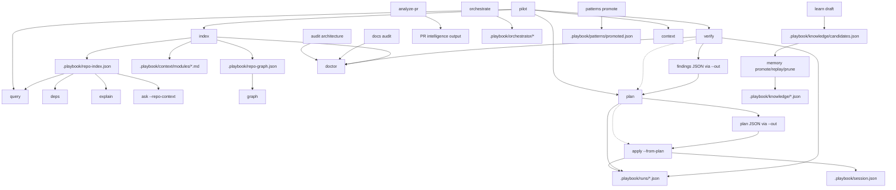

# Playbook CLI Command Dependency Graph

This document describes command-to-command and artifact dependencies in the Playbook CLI.

## Graph legend

- **Solid arrow (`A --> B`)**: command/data dependency (B requires artifact or state from A).
- **Dashed arrow (`A -.-> B`)**: soft dependency (B can run standalone but improves with A).
- **Artifact nodes**: deterministic files in `.playbook/` or docs outputs.

## Command + artifact graph

## Canonical remediation chain

`verify -> plan -> apply -> verify` remains the deterministic remediation backbone.

## High-value dependency notes

1. **Repository intelligence lane**: `index` is a hard prerequisite for `query`, `deps`, and strongly recommended before `ask --repo-context` / `explain`.
2. **Remediation lane**: `plan` can generate from live verify state, but reproducibility is strongest when it consumes a saved verify artifact and then feeds `apply --from-plan`.
3. **Execution evidence lane**: `verify`, `plan`, and `apply` all append run/session evidence, creating an implicit control-plane substrate consumed by session workflows.
4. **Meta-orchestration lane**: `pilot` is a composite command wrapper over `context/index/query/verify/plan`.
