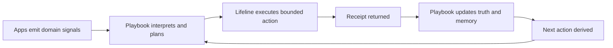

# Control loop and layer ownership (canonical)

This document makes layer ownership and the closed-loop operating model explicit.
It is the canonical ownership reference for Playbook ↔ Lifeline ↔ app boundaries.

## Layer ownership

| Layer | System | Owns | Must not own |
| --- | --- | --- | --- |
| Control plane | **Playbook** | Truth state, interpretation, planning, governance, memory, receipts, next-action derivation | Runtime supervision/execution internals for external operators/apps |
| Runtime/operator plane | **Lifeline** | Bounded execution, runtime supervision, runtime status/health, execution handoff back to Playbook | Canonical planning truth, governance adjudication, durable doctrine/memory ownership |
| Domain/signal plane | **Apps** | Domain events/signals, domain truth production, external contract payload inputs | Cross-repo governance/planning authority, Playbook control-plane state ownership |

## Canonical closed loop

```text
1) App emits signals
2) Playbook interprets signals and derives/updates plan
3) Lifeline executes bounded runtime action(s)
4) Execution receipt returns to Playbook
5) Playbook updates canonical truth + memory
6) Playbook derives next action from updated truth
```

### Compact loop diagram



## Failure domains (ownership-aware)

| Failure domain | Primary owner | Typical symptom | First boundary check |
| --- | --- | --- | --- |
| Contract validation | Playbook + contract boundary | Request/receipt rejected or schema mismatch | Validate request/receipt shape against canonical interop contract |
| Runtime execution | Lifeline | Action stuck/failed/blocked at runtime | Inspect runtime status/health and execution state transitions |
| CI/bootstrap | Playbook repo/runtime bootstrap | Command/doc checks fail before runtime loop | Re-run deterministic bootstrap (`build`, context/contract, docs audit) |
| Sync/drift | Shared seam (Playbook ↔ Lifeline ↔ app contract) | Action/receipt semantics diverge across layers | Compare emitted request + returned receipt against canonical loop contract |
| Governance/planning | Playbook | Plan/action mismatch or unresolved findings | Re-run verify -> plan -> apply -> verify and inspect governed findings |

## Related docs

- Interop seam details: [Playbook ↔ Lifeline interop](./playbook-lifeline-interop.md)
- Command-state/operator surface: [docs/commands/README.md](../commands/README.md)
