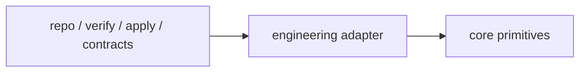

# Engineering Adapter

## Purpose

The Engineering Adapter maps engineering-domain artifacts into the domain-agnostic Minimum Cognitive Core.

## Mapping contract

- repo artifacts -> `Evidence`
- verify/apply outputs -> `Evidence`
- contracts -> doctrine/adapter output
- CI/doc/test concerns -> engineering adapter only

## Boundary

Engineering semantics must stay in this adapter layer.
Kernel semantics (`observe`, `represent`, `relate`, `compress`, `decide`) remain domain-agnostic.

## External runtime vs embedded copy

For consumer pilots (starting with Fawxzzy Fitness), execute the advisory cycle from the current Playbook repository runtime and pass the consumer repository as an external target path.

- **Embedded Playbook copy**: code snapshot stored inside a consumer repository and potentially stale.
- **External Playbook runtime**: current Playbook branch tooling analyzing a target repository path while emitting artifacts into that target's `.playbook/` directory.

This boundary prevents adapter conclusions from being skewed by drifted embedded tooling.

## Rule / Pattern / Failure Mode

Rule:
Engineering-specific semantics must stay inside adapter translation layers, and initial external pilots must run on the current Playbook runtime rather than stale embedded copies.

Pattern:
A bounded external pilot validates adapter mapping quality without requiring first-pass repository synchronization of embedded tooling.

Failure Mode:
When engineering logic leaks into kernel invariants—or the pilot executes from outdated embedded tooling—portability, determinism, and architecture conclusions degrade.
