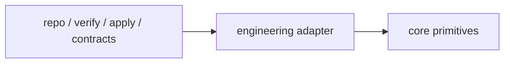

# Engineering Adapter

## Purpose

The Engineering Adapter maps engineering-domain artifacts into the domain-agnostic Minimum Cognitive Core.

## Mapping contract

- repo artifacts -> `Evidence`
- verify/apply outputs -> `Evidence`
- contracts -> doctrine/adapter output
- CI/doc/test concerns -> engineering adapter only

## Boundary

Engineering semantics must stay in this adapter layer.
Kernel semantics (`observe`, `represent`, `relate`, `compress`, `decide`) remain domain-agnostic.

## Rule / Pattern / Failure Mode

Rule:
Engineering-specific semantics must stay inside adapter translation layers.

Pattern:
Adapters localize domain complexity while preserving a stable reasoning kernel.

Failure Mode:
When engineering logic leaks into kernel invariants, portability, determinism, and replayable governance degrade.
